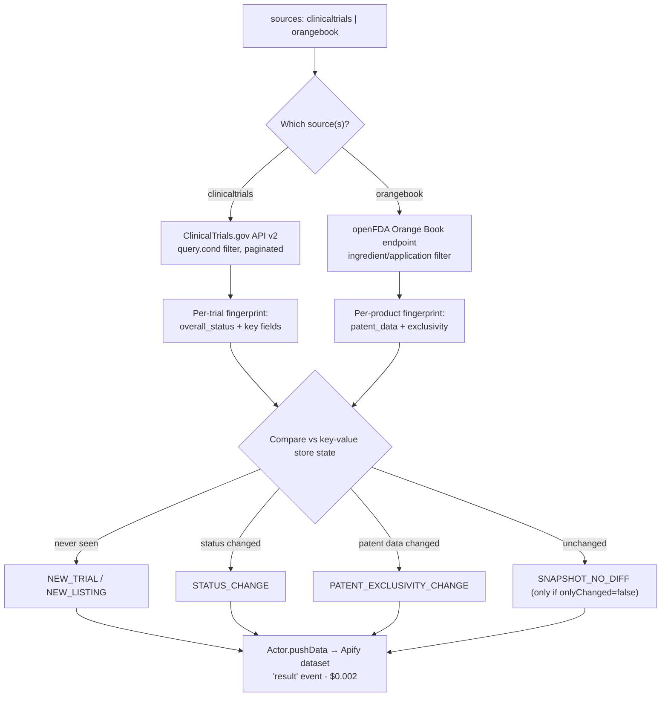

<h1 align="center">ClinicalTrials.gov + FDA Orange Book - Trial Delta API</h1>

<p align="center"><strong>Know the instant a clinical trial's status changes, or a drug's patent/exclusivity data shifts on the FDA Orange Book - not just what the record currently says.</strong></p>

<p align="center">
  <a href="https://apify.com"></a>
  <a href="#cost--byok-disclosure"></a>
  <a href="https://www.typescriptlang.org/"></a>
  <a href="LICENSE"></a>
</p>

<p align="center">
  <a href="https://apify.com/stefano_seggio/actor-24-clinical-trials-delta-engine"></a>
</p>

Monitors ClinicalTrials.gov (global trial registry) and the US FDA Orange Book for status and patent/exclusivity changes, delivering only what changed on whichever schedule you configure via Apify's own Scheduler - there is no fixed built-in cadence.

Live and public at [apify.com/stefano_seggio/actor-24-clinical-trials-delta-engine](https://apify.com/stefano_seggio/actor-24-clinical-trials-delta-engine). Owner console: [console.apify.com/actors/PkYgfW33Sh6teGXUX](https://console.apify.com/actors/PkYgfW33Sh6teGXUX).

> This repository is a documentation and integration wrapper around that Actor - the MIT license below covers this repo's own README, snippets, and docs, not the Actor's proprietary TypeScript source, which stays closed and hosted on Apify.

## What this actually monitors

ClinicalTrials.gov and the FDA Orange Book each publish real, official data - but neither publishes a change feed. A trial's `overall_status` moving from `RECRUITING` to `TERMINATED`, or a new patent/exclusivity entry landing on a drug product, is only visible to someone willing to re-fetch the same record over and over and diff it by hand.

This Actor walks both sources on a schedule and reports only what changed: a trial seen for the first time (`NEW_TRIAL`), a trial whose status changed since the last run (`STATUS_CHANGE`), a product newly listed in the Orange Book (`NEW_LISTING`), or a change to a product's patent/exclusivity data (`PATENT_EXCLUSIVITY_CHANGE`). Turn on delta mode (`onlyChanged`) and a scheduled run reports nothing at all when nothing moved, instead of re-delivering a full snapshot every time.

It's built for pharma competitive-intelligence teams tracking a competitor's trial pipeline, regulatory-affairs teams watching for exclusivity expiry on a specific drug product, and biotech/investment researchers who need a structured, versioned signal instead of manually refreshing two government websites.

## Architecture



Every page/extract fetch goes through a shared retry helper with full-jitter exponential backoff (default 5 attempts). The `clinicaltrials` source needs no API key; `orangebook` (via openFDA) works without one too, capped at 1,000 requests/day (240/min) - a free openFDA key raises that to 120,000/day at the same 240/min rate.

## Cost & BYOK Disclosure

This Actor bills on Apify's [Pay-Per-Event](https://apify.com/pricing) model - you pay only for what's actually delivered.

| Event name | What triggers it | Price |
|---|---|---|
| `result` | A new or changed trial/patent record is delivered (`NEW_TRIAL`, `STATUS_CHANGE`, `NEW_LISTING`, or `PATENT_EXCLUSIVITY_CHANGE`) | $0.002 per record |
| `actor-start` | Once per run, when the Actor starts | $0.00005 per run start |

`SNAPSHOT_NO_DIFF` rows (only ever delivered when `onlyChanged: false`) are never charged - an unchanged trial or Orange Book product whose fingerprint matches what was stored on the previous run is suppressed before delivery, so it costs $0.00. It is not charged and then refunded; it is simply never charged. A daily delta run against a narrow `condition` filter that finds nothing new costs only its `actor-start` fee ($0.00005).

**BYOK: none required.** This Actor needs no third-party API key to run. The optional `fdaApiKey` input exists solely to raise your own openFDA rate ceiling for the `orangebook` source (1,000 to 120,000 requests/day) - it is never required, never pooled, and has no effect on the `clinicaltrials` source at all.

## Quickstart

Three equivalent ways to run this Actor and get its dataset items back. Get your API token from [console.apify.com/settings/integrations](https://console.apify.com/settings/integrations).

### cURL (synchronous, no polling)

```bash
curl -X POST "https://api.apify.com/v2/acts/PkYgfW33Sh6teGXUX/run-sync-get-dataset-items?token=<YOUR_API_TOKEN>" \
  -H "Content-Type: application/json" \
  -d '{
  "sources": [
    "clinicaltrials"
  ],
  "condition": "diabetes",
  "maxPages": 5,
  "onlyChanged": true
}'
```

### Python (`apify-client`)

```python
# pip install apify-client
# run_monitor.py - calls the ClinicalTrials + Orange Book Delta Actor via the Apify API.
import os
from apify_client import ApifyClient

client = ApifyClient(os.environ["APIFY_TOKEN"])  # set this to your Apify API token

run_input = {
    "sources": ["clinicaltrials"],
    "condition": "diabetes",
    "maxPages": 5,
    "onlyChanged": True,
}

run = client.actor("stefano_seggio/actor-24-clinical-trials-delta-engine").call(run_input=run_input)
print(f"Run {run['id']} finished with status: {run['status']}")

dataset_items = client.dataset(run["defaultDatasetId"]).list_items().items
print(f"Delivered {len(dataset_items)} record(s):")
for item in dataset_items:
    print(f"- [{item['event_type']}] {item['record_id']}")
```

### Node.js (`apify-client`)

```javascript
// run-monitor.js - calls the ClinicalTrials + Orange Book Delta Actor via the Apify API.
import { ApifyClient } from 'apify-client';

const client = new ApifyClient({ token: process.env.APIFY_TOKEN });

const run = await client.actor('stefano_seggio/actor-24-clinical-trials-delta-engine').call({
    sources: ['clinicaltrials'],
    condition: 'diabetes',
    maxPages: 5,
    onlyChanged: true,
});

console.log(`Run ${run.id} finished with status: ${run.status}`);

const { items } = await client.dataset(run.defaultDatasetId).listItems();
console.log(`Delivered ${items.length} record(s):`);
for (const item of items) {
    console.log(`- [${item.event_type}] ${item.record_id}`);
}
```

Runnable copies of the Python and Node.js examples above (CommonJS `require()` variant for Node) live in `examples/run_monitor.py` and `examples/run-monitor.js` in this repo.

## Input & Output Schema

This is a documentation/integration wrapper repo with no local `.actor/input_schema.json` - the field list below is the real, complete input surface as documented and exercised in this README's own Quickstart examples above.

### Input

| Field | Input field | What it does |
| --- | --- | --- |
| Multi-source monitoring | `sources` | Track ClinicalTrials.gov, the FDA Orange Book, or both in one run. |
| Condition filter | `condition` | Passed to ClinicalTrials.gov's `query.cond` - e.g. `"diabetes"` to narrow the walk. |
| Orange Book filter | `orangeBookQuery` | Filters the Orange Book query to an ingredient name or application number. |
| Delta mode | `onlyChanged` | Persists a fingerprint per trial/product in a named key-value store, then delivers only new or changed records on later runs. |
| Configurable walk size | `maxPages` | Hard cap on the number of 100-record ClinicalTrials.gov API pages walked per run. |
| Resilient retries | `maxRetries` | Full-jitter exponential backoff per page/extract fetch before it's dead-lettered (default 5, max 10). |
| Optional openFDA key | `fdaApiKey` | Raises the Orange Book source's daily request ceiling from 1,000 to 120,000; not needed for `clinicaltrials`. |

### Output

One row per delta event, following the `overview` view in `.actor/dataset_schema.json`.

#### Sample Extracted Dataset (JSON)

```json
{
  "record_id": "NCT05123456",
  "event_type": "STATUS_CHANGE",
  "scraped_at": "2026-09-14T18:03:11.000Z",
  "is_new": false,
  "source_url": "https://clinicaltrials.gov/study/NCT05123456",
  "data_source": "clinicaltrials-gov",
  "nct_id": "NCT05123456",
  "brief_title": "A Study of Metformin Extended-Release in Adults With Type 2 Diabetes",
  "overall_status": "TERMINATED",
  "previous_status": "RECRUITING",
  "last_update_post_date": "2026-09-10",
  "status_verified_date": "2026-09-10",
  "lead_sponsor": "Example University Medical Center",
  "conditions": ["Type 2 Diabetes Mellitus"],
  "phases": ["PHASE3"]
}
```

An Orange Book `PATENT_EXCLUSIVITY_CHANGE` record instead carries `application_number`, `product_number`, `trade_name`, `ingredient`, `te_code`, and a raw `patent_data` object in place of the ClinicalTrials.gov-specific fields.

#### Field reference

| Field | Description |
|---|---|
| `record_id` | Stable identifier: the NCT number for a trial, or the Orange Book application/product number for a patent record. |
| `event_type` | `NEW_TRIAL`, `STATUS_CHANGE`, `NEW_LISTING`, `PATENT_EXCLUSIVITY_CHANGE`, or (only if `onlyChanged: false`) `SNAPSHOT_NO_DIFF`. |
| `scraped_at` | ISO-8601 timestamp of this run. |
| `is_new` | `true` if this is the first time this `record_id` has been seen. |
| `source_url` | Direct link back to the record on ClinicalTrials.gov or the Orange Book. |
| `data_source` | `clinicaltrials-gov` or `orange-book`. |
| `nct_id` | ClinicalTrials.gov trial identifier (trial records only). |
| `brief_title` | The trial's short title (trial records only). |
| `overall_status` | Current trial status, e.g. `RECRUITING`, `TERMINATED` (trial records only). |
| `previous_status` | The status recorded on the prior run, present on `STATUS_CHANGE` events. |
| `last_update_post_date` / `status_verified_date` | ClinicalTrials.gov's own recency fields for the trial record. |
| `lead_sponsor` | The trial's lead sponsor organization. |
| `conditions` / `phases` | The trial's studied condition(s) and phase(s). |
| `application_number` / `product_number` / `trade_name` / `ingredient` / `te_code` / `patent_data` | Orange Book-specific fields, present only on `NEW_LISTING`/`PATENT_EXCLUSIVITY_CHANGE` records. |

## Why not just poll it yourself

- **Zero infrastructure** - no scheduler, no state store, no server to keep alive; runs on Apify's platform on the schedule you set.
- **Two sources, one schema** - ClinicalTrials.gov trial deltas and FDA Orange Book patent/exclusivity deltas normalize into the same output shape instead of two separate integrations.
- **Built-in change detection** - `STATUS_CHANGE` and `PATENT_EXCLUSIVITY_CHANGE` are computed from fingerprints this Actor already maintains, at no extra request or cost.
- **Retry-hardened by default** - full-jitter exponential backoff on every page/extract fetch, so a transient network blip doesn't fail the whole run.

## Known limitations

- **openFDA rate limits apply to the Orange Book source.** Without `fdaApiKey`, high-volume Orange Book runs may hit the 1,000 requests/day ceiling; the `clinicaltrials` source is unaffected since it doesn't use this key.
- **No contractual support SLA.** Independently developed and maintained by Stefano Seggio (Delta Registry); issues and feature requests go through the Apify Store's Issues tab, typically triaged within 48 hours.

## Contributing & Local Setup

As disclosed above, this repository is a documentation and integration wrapper - the Actor's real scraping/delta-engine TypeScript source is proprietary and runs privately on Apify's platform, not checked into this repository. There is no `src/` here to clone and hack on.

That means useful contributions here are: improving this README, fixing or extending the Python/Node.js examples in `examples/`, or reporting a documentation error via a GitHub issue or PR on this repo. To report a bug in the Actor's actual behavior, request a new source/jurisdiction, or ask a product question, use the Apify Store's own Issues tab on the [Store listing](https://apify.com/stefano_seggio/actor-24-clinical-trials-delta-engine) - that's where the Actor's real maintainer (also the author of this repo) triages requests against the live source.

---

<p align="center">
Part of <strong>Delta Registry</strong> - pay-per-event regulatory &amp; compliance data infrastructure.<br>
For professional inquiries or enterprise licensing: <a href="https://www.linkedin.com/in/stefanoseggio-deltaregistry">linkedin.com/in/stefanoseggio-deltaregistry</a><br>
The rest of the fleet: <a href="https://github.com/stefanoseggio">github.com/stefanoseggio</a>
</p>
